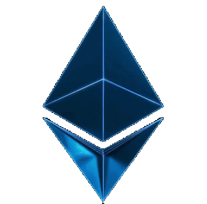

  

  <h1>Blockchain Explorer (Web)</h1>
  

    Blockchain Explorer (web) is a software that provides insight into all essential components of the blockchain. This includes information related to blocks, transactions, addresses, and so on.
  

 

  

 

  Powered by <a href='https://ethernal.tech/'>Ethernal-Tech</a>

 
 

### 🏗 — Architecture (Application structure)
___
                                           
It is a classic Web 2 application that relies on Web 3 technology. Therefore, the already well-known MVC architecture is used with some specific extensions. Extensions are all about offloading application logic to the service layer instead of controllers. The following techology stack were used in the implementation of the solution:
1. Golang (GO)
2. HTML
3. CSS
4. JavaScript
5. Bootstrap 5

 

### ⚡ — Requirements
___

There are two requirements to run the application. They are as follows:
1. Golang (GO) compiler - 1.19+ version (<a href='https://go.dev/doc/install'>go download</a>)
2. <a href='https://github.com/Ethernal-Tech/blockchain-explorer'>Blockchain explorer</a> (**by default the application works with the nswd blockchain explorer and database**)

 

### 🗊 — Note
___

The operation of the application (blockchain explorer web) is in strict connection with the application <a href='https://github.com/Ethernal-Tech/blockchain-explorer'>blockchain explorer</a>. The working principle is that the **blockchain explorer** fills and synchronizes the database with the actual state of the blockchain, while the **blockchain explorer web** reads and displays the content from the given database.

Therefore, it is necessary to first download the <a href='https://github.com/Ethernal-Tech/blockchain-explorer'>blockchain explorer</a>, connect it to the node and the database. After that, download blockchain explorer web and connect to the given database.

By default, at this point, blockchain explorer web is connected to the nswd database (where blockchain explorer is executed locally and "fills" the nswd database
with the Goerli blockchain data). <i>The only thing required for the application (blockchain explorer web) to work with the default settings is to request access to the nswd database. In other words, to request permission to access the nswd database from your IP address.</i>

 

### ⚙ — Installing and Running applications
___

Installation is very simple and consists of only a few steps:
1. download project
2. open windows command prompt or linux bash
3. positionate to the root directory of the project (the directory where, among other things, the server.go and routes.go files are located)
4. run the `go mod tidy` command to obtain all the necessary elements for the proper operation of the application
5. everything is now ready to install the application, run the command `go build *.go`
6. after the previous command is executed successfully the `.exe` file will appear in the same root directory
7. running the `.exe` file starts the web server (by default on port 8080)

Notes:
1. if the application doesn't want to start, check if the port 8080 is free or just change the port of the blockchain explorer web application
2. it is assumed that before starting the application, the configuration file has been filled with the correct data related to the connection to the database, or that permission to access the nswd database has been provided if the default settings are used

 

### 🚧 — Configuration file (.env)
___

The configuration file enables fine-tuning of the application. One of the more important settings is related to connecting to the database. The following fields provide it: `DB_USER`, `DB_PASSWORD`, `DB_HOST`, `DB_PORT` and `DB_NAME`. It is necessary to set your own instead of the default values. If you leave the defaults, the connection will be made with the nswd database.

 
 

 
 

